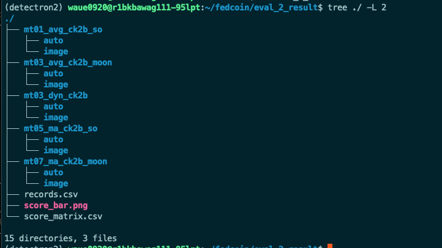

# eval_detectron2

本資料夾提供 Detectron2 物件偵測模型的自動化驗證與分析最小專案，方便快速複製、驗證與分析。

## 程式特色
```
* 改編自 https://github.com/ccuvislab/draw_tp_fp_bbox?tab=readme-ov-file
* 自動掃描權重檔，建立相對應的資料夾，並加入 tp, fp, fn 的座標與標籤，使用 json 格式
* eval1.py 預設使用 GPU，並將比對結構從 list 改成 set 以提升效能（原 bdd val 一個模型需 4 小時可減至 30 分鐘內）
* analy2.py 以 eval1.py 輸出為基礎，支援三種分析模式：
   * auto  : 每個模型以分數最高的 10 張圖畫圖，並產生統計 csv 與長條圖
   * image : 針對特定一張圖，畫出所有模型
   * score : 每 row 為驗證集 jpg，column 為所有模型權重的分數
```

## 注意事項
```
* 預設使用 eval_1_draw_bbox 與 eval_2_result 資料夾，若已存在則會覆寫，請自行備份
* 每次執行會掃描 weights 內全部權重，不會比對前次差異
```

## 專案結構
```
eval_detectron2/
├── eval1.py                # 自動化驗證主程式
├── analy2.py               # 分析與可視化主程式
├── configs/
│   └── evaluation/
│       ├── <config1>.yaml  # 驗證用 Detectron2 設定檔
│       └── <config2>.yaml
```

## 各檔案用途
- `eval1.py`：批次執行 Detectron2 驗證，產生標註與統計結果
- `analy2.py`：分析 `eval1.py` 產生的結果，支援 auto/image/score 三種模式
- `configs/evaluation/*.yaml`：驗證用 Detectron2 設定檔

## 分數計算方式
每張圖片分數計算方式：
```
tp_num*100 - fn_num*1 - fp_num*0
```

## 基本操作流程

### skf2c
```bash
# 0. 將所有需要評估的 skf2c*.pth 放到 ./weights/
# 1. 執行驗證
python eval1.py --config-file configs/evaluation/cityeval.yaml
# 2. 進行分析（auto/image/score 三種模式）
python analy2.py --mode auto --dataset-path data/VOC2007_cityval/JPEGImages/
python analy2.py --mode image --dataset-path data/VOC2007_cityval/JPEGImages/ --image-name munster_000056_000019_leftImg8bit.jpg
python analy2.py --mode score
```

### ck2b
```bash
# 0. 將所有需要評估的 ck2b*.pth 放到 ./weights/
# 1. 執行驗證
python eval1.py --config-file configs/evaluation/bddeval.yaml
# 2. 進行分析（auto/image/score 三種模式）
python analy2.py --mode auto --dataset-path data/VOC2007_bddval/JPEGImages/
python analy2.py --mode image --dataset-path data/VOC2007_bddval/JPEGImages/ --image-name xxxx.jpg
python analy2.py --mode score
```

---

### snapshot


- **weights.png**：權重檔案放置於 weights/ 目錄，供 eval1.py 自動掃描。

  

- **eval1_final.png**：eval1.py 執行過程，會自動建立模型資料夾並產生對應結果。

  

- **eval1_results.png**：eval1.py 執行完畢後，產生的主資料夾結構與結果檔案。

  

- **ana2_auto_final.png**：analy2.py auto 模式，產生分數最高 Top-10 標註圖。

  

- **ana2_image_final.png**：analy2.py image 模式，針對單張圖片產生所有模型標註。

  

- **ana2_score.png**：analy2.py score 模式，產生所有模型在所有圖片上的分數矩陣。

  

- **ana2_results.png**：analy2.py 執行後，產生的分析結果總覽。

  

